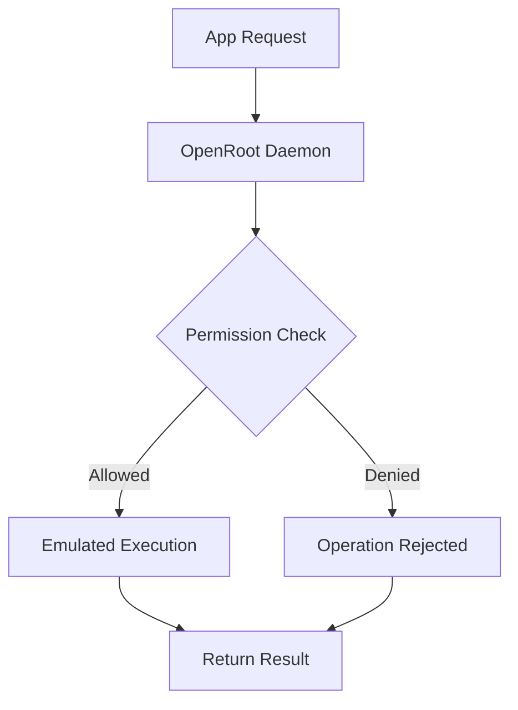

# OpenRoot

<div align="center">
    
    <p><strong>A Cross-Unix Root Emulation Solution</strong></p>
    <p>
        <a href="LICENSE"></a>
        <a href="https://github.com/oakymacintosh/OpenRoot/releases"></a>
        <a href="https://github.com/oakymacintosh/OpenRoot/stargazers"></a>
    </p>
</div>

## Introduction

OpenRoot is an innovative root emulation layer that provides root-like capabilities without requiring actual root access or bootloader unlocking. It works across Unix-like systems and Android devices, offering a safe way to execute privileged operations through a controlled emulation environment.

### Key Features

- **No Unlocked Bootloader Required**: Works on locked bootloader devices
- **Cross-Platform Support**: Works on Android and other Unix-like systems
- **Safe Root Emulation**: Controlled environment for root-like operations
- **Easy-to-Use Interface**: Both GUI (Droid-Chan) and CLI options
- **Fine-Grained Permissions**: Control what apps and operations are allowed
- **Live Updates**: No reboots required for most operations

## Installation

### Android

1. Download the latest APK from [Releases](https://github.com/oakymacintosh/OpenRoot/releases)
2. Install the APK:
   ```bash
   adb install OpenRoot.apk
   ```
3. Launch the Droid-Chan app and follow the setup wizard

### Other Unix Systems

1. Install dependencies:
   ```bash
   # Debian/Ubuntu
   sudo apt install build-essential cmake nlohmann-json3-dev libspdlog-dev

   # Fedora
   sudo dnf install gcc-c++ cmake nlohmann-json-devel spdlog-devel

   # Arch Linux
   sudo pacman -S base-devel cmake nlohmann-json spdlog
   ```

2. Build from source:
   ```bash
   git clone https://github.com/oakymacintosh/OpenRoot.git
   cd OpenRoot
   mkdir build && cd build
   cmake ..
   make
   sudo make install
   ```

## Usage

### Android Interface (Droid-Chan)

1. Launch the Droid-Chan app
2. Grant necessary permissions
3. Enable root emulation
4. Manage apps and permissions through the UI

### Command Line Interface

Basic operations:
```bash
# Check root emulation status
rootd status

# Allow an app to use root emulation
rootd grant com.example.app

# Revoke root emulation from an app
rootd revoke com.example.app

# List allowed apps
rootd list

# Configure permissions
rootd config set allow_mount true
```

### Web Interface

1. Access the web interface at `http://localhost:8080` or through Droid-Chan
2. Log in with your credentials
3. Manage root operations through the web dashboard

## How It Works

OpenRoot creates a controlled environment that intercepts and emulates root operations:

1. **Process Interception**: Captures privileged operation requests
2. **Permission Verification**: Checks against configured allowed operations
3. **Safe Execution**: Performs operations in a sandboxed environment
4. **Result Emulation**: Returns appropriate responses to the requesting app



## Security Considerations

- OpenRoot does NOT break system security
- All operations are emulated in a controlled environment
- Fine-grained permission system prevents abuse
- Regular security audits and updates

## Contributing

We welcome contributions! Please see our [Contributing Guidelines](CONTRIBUTING.md) for details.

1. Fork the repository
2. Create your feature branch
3. Commit your changes
4. Push to the branch
5. Create a Pull Request

## Building from Source

### Prerequisites

- CMake 3.15+
- C++17 compatible compiler
- Android NDK (for Android build)
- vcpkg (for dependency management)

### Build Steps

```bash
# Configure with vcpkg
cmake -B build -S . -DCMAKE_TOOLCHAIN_FILE=[path_to_vcpkg]/scripts/buildsystems/vcpkg.cmake

# Build
cmake --build build

# Install
sudo cmake --install build
```

## Credits

OpenRoot is inspired by various root solutions and Unix system designs:
- [Magisk](https://github.com/topjohnwu/Magisk)
- [KernelSU](https://github.com/tiann/KernelSU)
- [Wine](https://www.winehq.org/)
- [Darling](https://www.darlinghq.org/)

## License

OpenRoot is licensed under the GNU General Public License v3.0. See [LICENSE](LICENSE) for details.

## Support

- [GitHub Issues](https://github.com/your-username/OpenRoot/issues)
- [Telegram Group](https://t.me/OpenRootOfficial)
- [XDA Thread](#)

## FAQ

### Q: Is this a "real" root solution?
A: No, OpenRoot is a root emulation layer. It provides root-like capabilities without actually requiring root access.

### Q: Will this void my warranty?
A: No, OpenRoot doesn't modify system files or require bootloader unlocking.

### Q: Is this safe to use?
A: Yes, OpenRoot runs in a controlled environment and can't perform actual system modifications without explicit permission.

### Q: Does this work on all devices?
A: OpenRoot should work on most Android devices and Unix-like systems. Check our compatibility list for details.

## Documentation

For detailed documentation, please visit our [Wiki](https://github.com/your-username/OpenRoot/wiki).

- [Installation Guide](docs/installation.md)
- [Configuration Guide](docs/configuration.md)
- [API Documentation](docs/api.md)
- [Security Model](docs/security.md)
- [Development Guide](docs/development.md)
